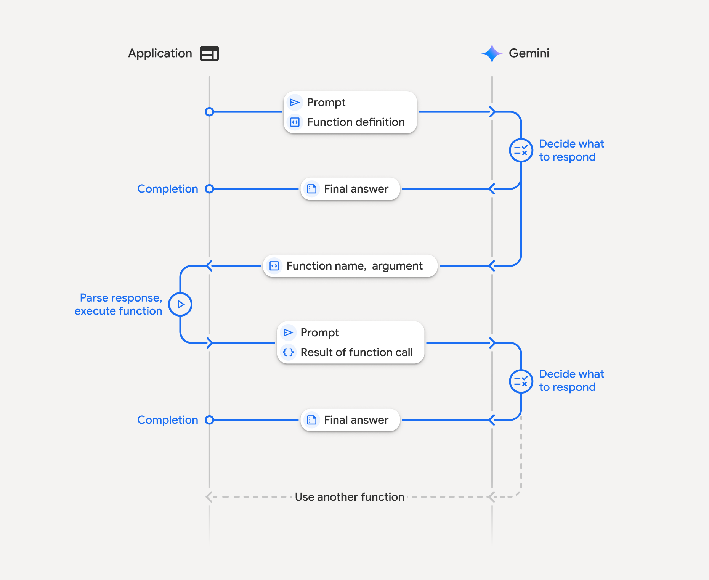
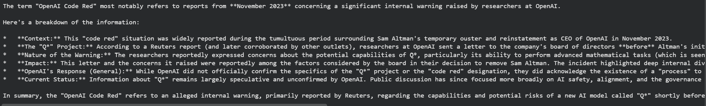

## **What is function calling in LLMs?**
Large Language Models cannot access external systems such as APIs, databases, or SaaS apps independently; function calling is the pattern that enables them to do so safely. 
Instead of returning only natural language, the model can decide to “call” a function by emitting a structured description of which tool to use and which parameters to pass.
You expose your internal or third‑party APIs to the model as functions, and the LLM chooses when and how to use them for tasks like sending emails, updating Sheets, scheduling events, or fetching live data such as weather and stock prices.
Irony is that, despite the name, the LLM does not execute code itself; it returns a structured **`functionCall`** An object that your application uses to trigger real API calls and then feed results back to the model.

---

## **How does Gemini function calling work?**



Gemini’s function-calling API follows a multi-step loop with fixed terminology and data structures.
1. You declare tools as functions:
1. User sends a request with tools:
1. Gemini returns `functionCall` object:
1. The app code executes the function(s)
1. You send tool results back to Gemini
In essence, the model proposes tool calls → the app executes them and passes conversation + tool results → the model synthesises results → new prompt & same repeats.
Surprisingly, *this simple loop is the backbone of agentic workflows with any LLM!*

---

## Tool calling with Gemini 
In the **`google-genai`** Python SDK, we work with a **`Client`**, **`FunctionDeclaration`**,
and **`GenerateContentConfig`** to declare tools and read **`function_call`** parts in the response.
The steps are as follows.

### The Steps
**1. Install the library and set up the workspace**
Let’s start by installing the SDK and configuring the client. Open your terminal and paste the following command to installthe  generative AI package:

```shell
pip install -q -U google-genai
```
Next, create a new Python file and import the following:

```shell
from google import genai
from google.genai import types

client = genai.Client(api_key="YOUR_GEMINI_API_KEY") # can do it from .env also
```
Pretty self-explanatory, right

**2. Initial request: user query + tool definitions**
Now is the time to add the initial request & tool definition. Let’s go with the tool definition first!

```python
get_weather_fn = types.FunctionDeclaration(
    name="get_weather",
    description="Get the current weather conditions for a specific location.",
    parameters={
        "type": "object",
        "properties": {
            "location": {
                "type": "string",
                "description": (
                    "The city and state/country, e.g., 'San Francisco, CA' or 'London, UK'."
                ),
            }
        },
        "required": ["location"],
    },
)

get_stock_price_fn = types.FunctionDeclaration(
    name="get_stock_price",
    description="Get the current stock price for a given ticker symbol.",
    parameters={
        "type": "object",
        "properties": {
            "ticker_symbol": {
                "type": "string",
                "description": "The stock ticker symbol, e.g., 'GOOGL' or 'AMZN'.",
            }
        },
        "required": ["ticker_symbol"],
    },
)
```
Here we create two function schemas. For this, we used **`FunctionDeclaration`** from `types` class. Think of it as a wrapper over the tool details that Gemini expects.
Each **`FunctionDeclaration`** includes a **`name`**, **`description`**, and **`parameters`** JSON schema describing accepted arguments.

Now let’s add our query:

```python
tool = types.Tool(function_declarations=[get_weather_fn, get_stock_price_fn])

user_prompt_content = types.Content(
    role="user",
    parts=[types.Part.from_text("What's the weather like in London?")],
)

response = client.models.generate_content(
    model="gemini-2.5-flash",
    contents=[user_prompt_content],
    config=types.GenerateContentConfig(tools=[tool]),
) 
```
Key parts here are:
- model: A Gemini model that supports function calling, such as **`gemini-2.0-flash`**.
- contents: Conversation history as a list of **`Content`** objects; here it starts with a single user message.
- tools: A list with one **`Tool`** that wraps multiple **`FunctionDeclaration`** objects. We covered this earlier

**3. Gemini’s response: requesting tool use**
As this is not a typical query, the model might use tools. In that case, it returns the response that contains a `function_call` in one of its parts. We need to extract that:

```python
# simple code to extract the output of parts -> function call

candidate = response.candidates[0]
parts = candidate.content.parts

function_call_part = next(
    (p for p in parts if p.function_call is not None),
    None,
)

if function_call_part:
    fc = function_call_part.function_call
    print("Function name:", fc.name)
    print("Function args:", fc.args)
```
The extracted `function_call` should follow the schema as:

```json
{
  "candidates": [
    {
      "content": {
        "role": "model",
        "parts": [
          {
            "functionCall": {
              "name": "get_weather",
              "args": {
                "location": "London, UK"
              }
            }
          }
        ]
      }
    }
  ]
}
 

```
Important fields here are :
- `parts[].function_call.name:` Name of the tool (e.g., "`get_weather`") that matches the schema declaration.
- `parts[].function_call.args`: Object containing parameters Gemini inferred from the schema and user prompt.
In the last part of the Python code, we are extracting this only. You can check the output by running it yourself.
> **Note** : Gemini can return multiple function call parts if it wants to use several tools in a single step.

**4. Subsequent request: providing the tool result**
Now that we have the request to execute the function, the app will execute it, and we need to pass the result to the model:

```python
# define the tool (demo)
def get_weather(location: str) -> dict:
    # Mock api to mimic get_weather_results.
    return {
        "location": location,
        "temperature_c": 15,
        "condition": "mostly cloudy",
    }

# check if model actually returned a function_call part or not.
if function_call_part:
    fc = function_call_part.function_call
    tool_name = fc.name
    args = dict(fc.args)

		# conditionally run the tool 
		# (get_weather, get_stock_price)
    if tool_name == "get_weather":
        function_result = get_weather(args["location"])
    elif tool_name == "get_stock_price":
        # Implement get_stock_price here
        function_result = {"error": "get_stock_price not implemented"}
    else:
        function_result = {"error": f"Unknown function '{tool_name}'"}

		# wraps the tool call output & convert it to structured data
		# important for gemini to use
    function_response_part = types.Part.from_function_response(
        name=tool_name,
        response=function_result,
    )
    
    # defining model -> repersents model previous turn
    function_call_content = types.Content(
        role="model",
        parts=[function_call_part],
    )
		
		# define tool -> resperesent tool result to model's request 
    function_response_content = types.Content(
        role="tool",
        parts=[function_response_part],
    )
		
		# merge to pass tool result, prompt & conversation history.
		# also make model aware of tools being used.
    final_response = client.models.generate_content(
        model="gemini-2.5-flash",
        contents=[
            user_prompt_content,
            function_call_content,
            function_response_content,
        ],
        config=types.GenerateContentConfig(tools=[tool]),
    )
		
		# finally print the output - in natural language
    print(final_response.text)

```
Here:
- **`Part.from_function_response`** wraps the tool output so Gemini can consume it as structured data, not just plain text.
- **`role="tool"`** The content makes it clear this is a tool result, not another user or model message.
-  Gemini then reads history, uses the tool result, and generates a final natural-language reply (or possibly more tool calls).
- Check it for yourself.

Now let’s try to use a tool called to concretize our understanding

---

### Function Calling with Composio Tools
Composio provides access to 900+ tools, including Google Gemini support, so we can leverage it to get up to speed without worrying about manual tool write-ups and authentication. Let’s code one to understand better.

We start by installing composio packages:

```python
!pip install google-genai composio-gemini composio
```
Then we import libraries and set up configs:
To get the Composio API key:
- Head to Composio , either login/signup
- Once in, go to settings → New Api Key → add name & hit create
- Copy it somewhere safe, only visible once.
- Also copy the `user_id` In the **Debug info for support. **We need this later on to authenticate composio tools.

```python
import os
from google.colab import userdata
os.environ['COMPOSIO_API_KEY'] = userdata.get('COMPOSIO_API_KEY')

from composio import Composio
from composio_gemini import GeminiProvider
from google import genai
from google.genai import types
```
Then we create a composio and a Gemini client:

```python
# Create composio client
composio = Composio(provider=GeminiProvider())

# Create google client
client = genai.Client()
```
Next, we add the composio user id and load tools, set up configs. For tools, we are using Composio’s DuckDuckGo search tool:

```python
user_id = "e92b1112-5c68-4501-8af4-49af4199592f"

# Ge tools using the new SDK structure
tools = composio.tools.get(user_id, toolkits=["DUCKDUCKGO"])

# Create genai client config
config = types.GenerateContentConfig(tools=tools)
```
Then we create a chat and fire up a query to llm:

```python
# Use the chat interface
chat = client.chats.create(model="gemini-2.5-flash", config=config)

response = chat.send_message("search about the latest info on OpenAI Code Red")

print(response)
```
Here is the output (middle part, usually hidden):


As can be seen, the response object consists of `function_call `key along with name, query and role.  Time to extract the results.
Finally, we beautify the output:

```python
# Check if there are candidates and content parts
if hasattr(response, 'candidates') and response.candidates:
    candidate = response.candidates[0]
    if hasattr(candidate, 'content') and candidate.content.parts:
        for part in candidate.content.parts:
            # Print only the text content if available
            if hasattr(part, 'text') and part.text:
                print(part.text)
```
Result:


Excellent, we got the response, and this is how Composio abstracts away manual tool writing; however, this doesn’t end here. What if you have to access multiple tools across multiple use cases?

This is where Composio’s tool routing comes into play. Let’s see it in action!

---

### Function Calling with Composio Tool Router MCP with Google ADK
Google ADK (Agent Development Kit) is Google’s opinionated framework for building full-blown agents.  
Unlike the raw Gemini SDK, ADK provides primitives for tools, routing, sessions, web UIs, and multi‑turn orchestration, making it far better suited for serious workloads such as production agents, dashboards, and complex automation flows. 
But it’s limited in terms of tools, and for cross-application workflows, you’ll need to build integrations. However, creating these can take an eternity; if it’s not central to your core product, you can use Composio toolkits. We also have an even better abstraction, Tool Router.
Tool Router MCP is a unified interface that lets an agent **search**, **plan**, **authenticate**, and **execute** actions across thousands of Composio tools. This means less thinking, more building. 
The Tool router MCP is super simple to use with Google ADK. Let’s see it in action.

We start by installing the required packages:

```shell
python3 -m venv .venv
source .venv/bin/activate
pip install google-adk composio composio_google
```
We then initialise the project with:

```shell
adk create composio_agent
```
And select: 
- root agent model as `gemini-2.5-flash` , 
- model provider as `Google AI` and 
- Add the respective `GOOGLE_API_KEY` key when prompted. Get it from Google Studio.
This leaves us with a new directory with the name `gmail_agent`  along with all essential files (.env, **agent.py** and **__init__.py**.
Next, we open `gmail_agent/agent.py`  and add the code:

```shell
import os
import warnings

from composio import Composio
from composio_google import GoogleProvider
from dotenv import load_dotenv
from google.adk.agents.llm_agent import Agent
from google.adk.tools.mcp_tool.mcp_session_manager import \
    StreamableHTTPConnectionParams
from google.adk.tools.mcp_tool.mcp_toolset import McpToolset

load_dotenv()

# This BaseAuthenticatedTool warning comes from ADK itself, it's nothing serious.
# Makes the entire UI, shit, so just ignore it here....
warnings.filterwarnings("ignore", message=".*BaseAuthenticatedTool.*")

GOOGLE_API_KEY = os.getenv("GOOGLE_API_KEY")
COMPOSIO_API_KEY = os.getenv("COMPOSIO_API_KEY")
COMPOSIO_USER_ID = os.getenv("COMPOSIO_USER_ID")

if not GOOGLE_API_KEY:
    raise ValueError("GOOGLE_API_KEY is not set in the environment.")
if not COMPOSIO_API_KEY:
    raise ValueError("COMPOSIO_API_KEY is not set in the environment.")
if not COMPOSIO_USER_ID:
    raise ValueError("COMPOSIO_USER_ID is not set in the environment.")

try:
    print("Initializing Composio client...")
    composio_client = Composio(api_key=COMPOSIO_API_KEY, provider=GoogleProvider())

    print("Creating Composio session...")
    composio_session = composio_client.experimental.tool_router.create_session(
        user_id=COMPOSIO_USER_ID,
        toolkits=["composio_search"],
    )

    COMPOSIO_MCP_URL = composio_session.url
    print(f"Composio MCP HTTP URL: {COMPOSIO_MCP_URL}")

    print("Creating Composio toolset for the agent...")
    composio_toolset = McpToolset(
        connection_params=StreamableHTTPConnectionParams(url=COMPOSIO_MCP_URL)
    )
    root_agent = Agent(
        model="gemini-2.5-pro",
        name="composio_agent",
        description="An agent that uses Composio tools to perform actions.",
        instruction=(
            "You are a helpful assistant connected to Composio. "
            "Use the available tools to answer user queries and perform actions. "
            "Execute the tools directly without asking for confirmation."
            "Just execute any tools that's required. no confirmation, at all. just run tools, directly when needed."
        ),
        tools=[composio_toolset],
    )
    print("\nAgent setup complete. You can now run this agent directly ;)")

except Exception as e:
    print(f"\nAn error occurred during agent setup: {e}")


```
and revert to `.env `file to add the environment variables:

```shell
GOOGLE_GENAI_USE_VERTEXAI=0
GOOGLE_API_KEY= your-gemini-api-key-from-build-studio
COMPOSIO_API_KEY = composio-api-key-from-dashboard
COMPOSIO_USER_ID = composio-user-id-from-dashboard
```
 Then execute the code:

```shell
adk web .
```
Result:
As you can see, the model understood the query, called the `composio_search` via `tool_router_mcp` , executed the required tool and its methods and finally returned a task completion response. 
So this marks the end of tool router use. However, sometimes the tool router mcp / any mcp call fails, so let’s look at how to handle that.

---

## Prompting Tips & Conclusion
While function calling is compelling, getting LLMs like Gemini to use tools as intended often reliably requires careful design and iteration. 
If you find Gemini isn't calling functions when expected, calls the wrong function, or provides incorrect parameters, here are several strategies to improve performance:
1. Optimise tool definitions
1. Refine schemas and prompts
1. Handle execution and errors carefully
1. Choose the right Gemini model and configuration
1. Log, iterate, and test
So in the end I can only say:
With well-structured functions, clean schemas, and a robust Python handler loop, Gemini function calling lets you build powerful agents that combine strong reasoning with live access to APIs, databases, and platforms like Composio.


## Frequently Asked Questions

### What is the difference between function calling and tool use?
Function calling and tool use are the same concept with different terminology. Function calling refers to the LLM's ability to output structured requests for specific functions, while tool use is a broader term that encompasses the entire pattern of exposing external capabilities (APIs, databases, services) to the model. In practice, when an LLM performs function calling, it's engaging in tool use by selecting and invoking the appropriate tool for a given task.

### Can Gemini execute functions directly, or do I need to implement the execution layer?
Gemini cannot execute functions directly. The model only returns a structured `functionCall` object that describes which function to call and what parameters to use. Your application code must implement the execution layer—parsing the function call, invoking the actual API or service, handling errors, and returning results back to the model. This design keeps the LLM safe and sandboxed while giving you full control over what actions are actually performed.

### How do I handle cases where Gemini calls the wrong function or provides incorrect parameters?
When Gemini selects the wrong function or provides bad parameters, start by improving your function definitions with clearer descriptions, more specific names, and stricter JSON schemas (use enums, proper types, and required fields). Add explicit instructions in your system prompt about when to use each tool. Implement validation and error handling in your execution layer to catch invalid inputs early, and return descriptive error messages that help Gemini understand what went wrong so it can retry or explain the issue to the user.

### What is Composio's Tool Router MCP and how does it simplify working with multiple tools?
Composio's Tool Router MCP (Model Context Protocol) is a unified interface that provides a single endpoint for searching, planning, authenticating, and executing actions across thousands of tools and integrations. Instead of manually defining and managing dozens of individual function schemas, you connect to the Tool Router MCP, which dynamically exposes relevant tools based on your query. This dramatically reduces boilerplate code and makes it easy to build agents that can seamlessly work across multiple platforms and services without writing custom integration code for each one.

- One defines tools with one or more function declarations (schemas), each with a name, description, and parameters, using an `OpenAPI`‑like JSON structure.
- These declarations tell Gemini which external capabilities are available and how to call them.
- The request includes the user’s prompt and the tools configuration, passed typically via `GenerateContentConfig` in the Python SDK.
- Gemini reads the prompt and the tool descriptions, then decides whether a function call is needed.* Prompting is key here!*
- Instead of a final text answer, Gemini may respond with one or more `functionCall` objects in the candidate’s` content.parts` . (crucial)
- Each `functionCall`  object specifies the function name and a JSON-compatible `args` object containing parameters that match the defined schema.
- The backend inspects the response, extracts each `functionCall`, and invokes the corresponding function or external API with the provided `args`.   (We got this from the Gemini)
- This is where one can handle authentication, validation, error handling, and any side effects, which are critical in production. Sadly, Genai SDK don’t provide support for the same.
- You pass the original conversation plus tool results, wrapped as function response parts, in another `generate_content` call.
- Gemini then uses this data to produce a final natural-language answer or further function calls.
- This step is primarily handled in the backend, so it is not shown to users. They feel like LLM is handling it. 
- However, in most cases, developers have to pass the results and the original conversation. You can refer to the official Gemini docs to learn more.

- Write clear descriptions that explicitly state when to use each tool and optionally include short inline examples.
- Use intuitive, distinct function names and keep each tool focused on a narrow responsibility.
- Use proper JSON schema types (string, number, boolean, object, array) plus enums to guide valid inputs strongly.
- In the user/system prompts, mention that the model should use tools when it needs external data or must perform actions.
- Implement robust error handling in your Python functions (network issues, invalid parameters, timeouts, etc.).
- Return informative error messages via function responses so Gemini can explain failures or retry gracefully.
- Use more capable models like **`gemini-3.0-flash`** or later releases for better reasoning and tool selection.
- Consider using tool configuration options (e.g., forcing specific tools) when you need deterministic function calls.
- Log prompts, function calls, tool arguments, tool outputs, and final responses to debug misuses or missing parameters.
- Iterate on descriptions, schemas, and result formats based on real traces to steadily improve reliability.
