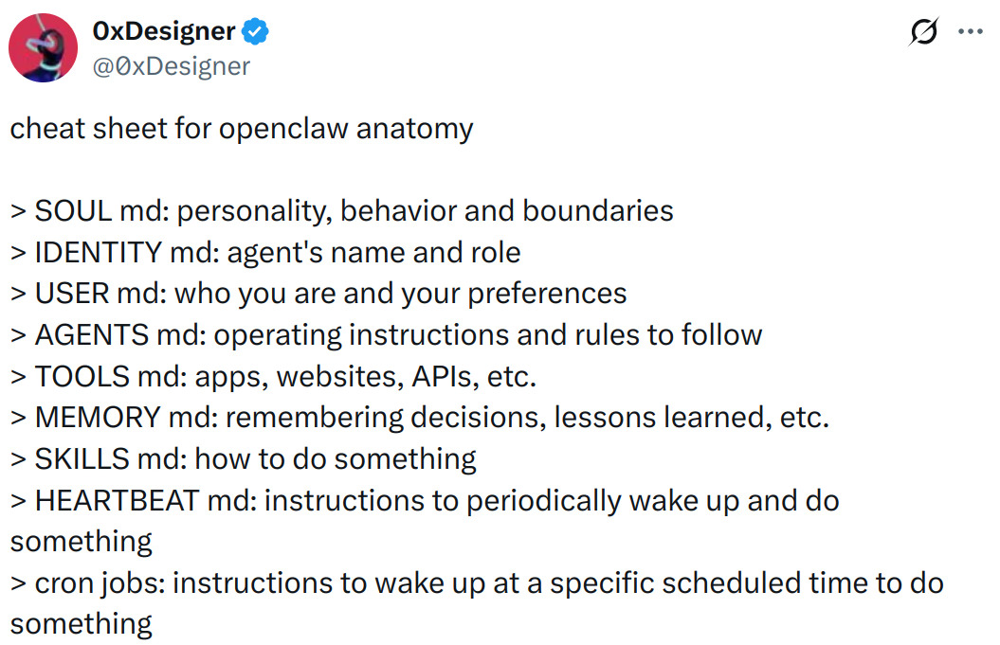
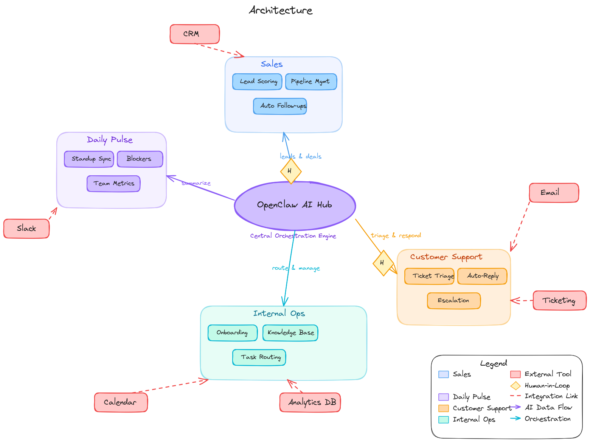
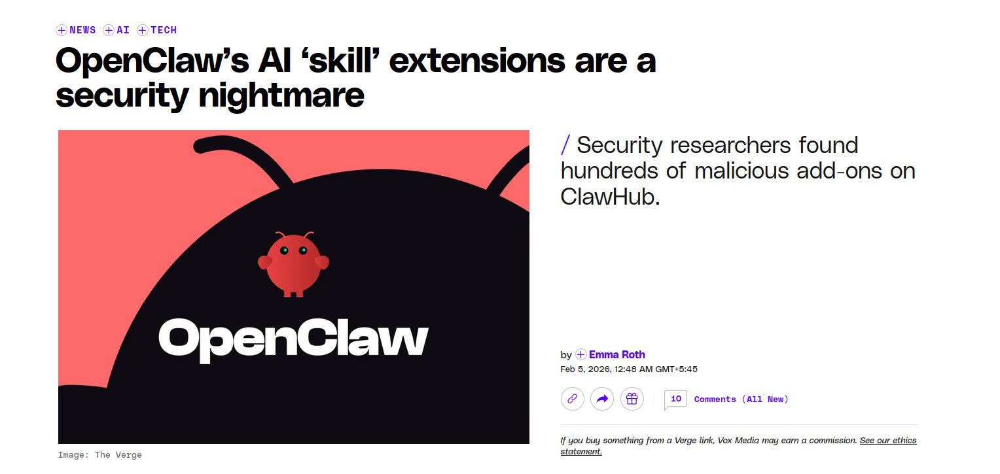
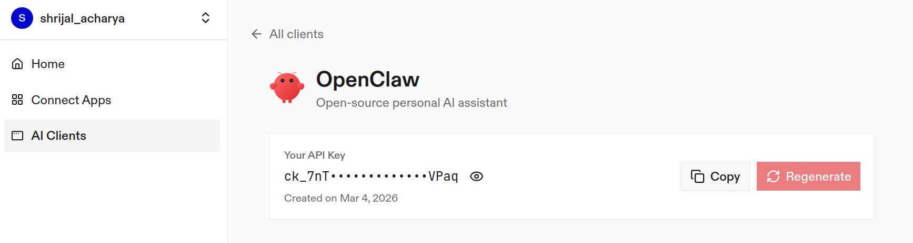
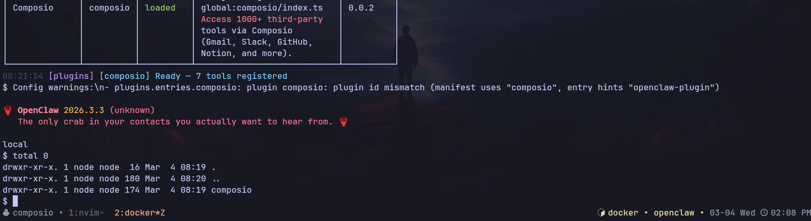
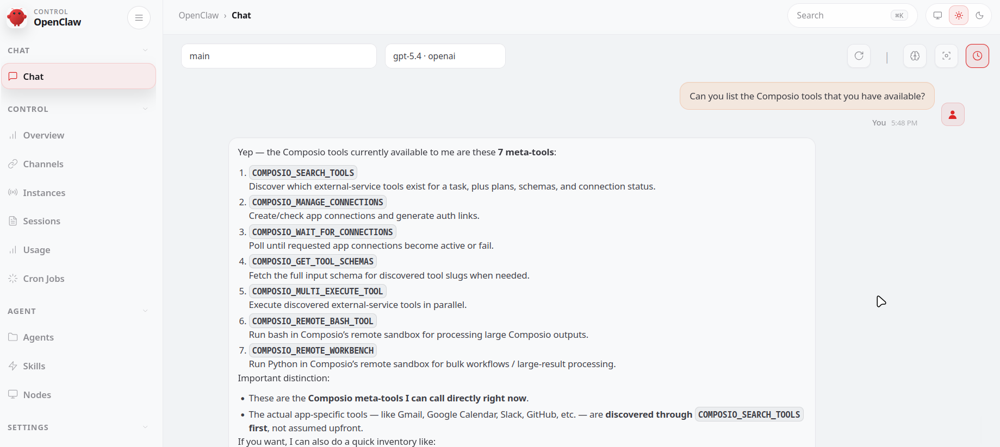
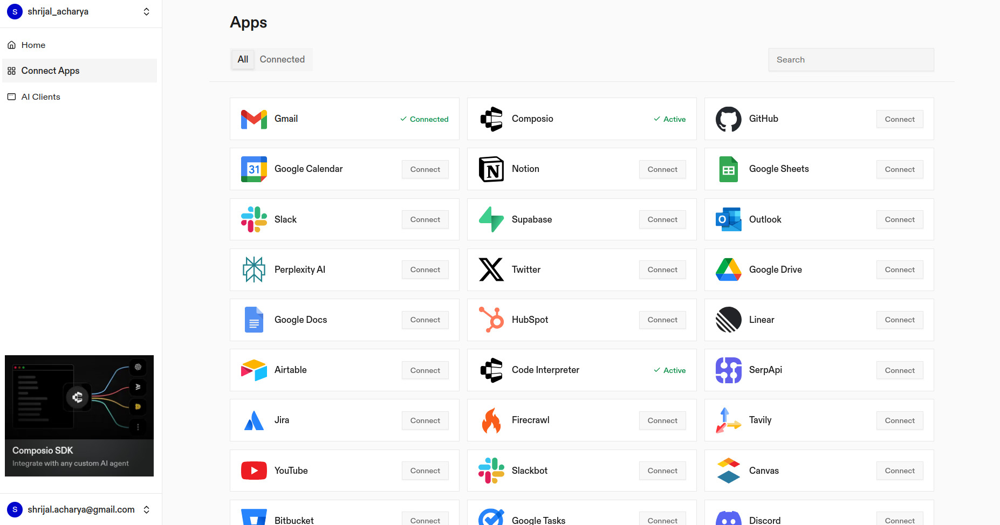
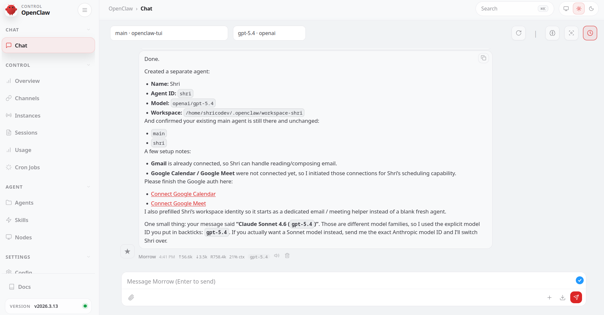
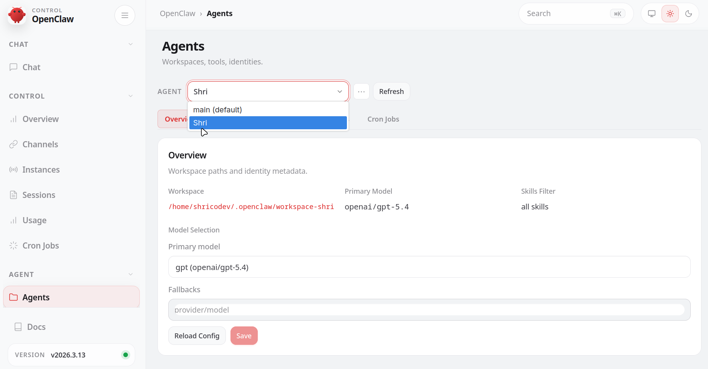

Imagine owning a company with just one human employee, and that too is yourself. The rest? All OpenClaw agents!

Before OpenClaw, that would have sounded completely silly, but with it, it's possible, **really possible!**

You can automate your entire company or simulate a fully functioning one with just OpenClaw and your VPS, Mac Mini, or local system for testing.


---

## TL;DR

In this tutorial, you'll learn how to run an entire company using just yourself and a bunch of **OpenClaw agents**.

What you will learn:

- What OpenClaw is and how it works
- Why storing API keys locally is a bad idea
- Setting up **Composio** for secure OAuth-based integrations
- Connecting your first app and getting agents up and running

Ready to become a one-person company?

---

## What's OpenClaw?


> I assume you already know what OpenClaw is. If not, why are you even here? Just kidding... The blog itself is completely beginner friendly. If you already have an idea of what OpenClaw is, just skip this section.

OpenClaw is a personal AI assistant you run on your own machine (or a server you own). It is the thing that actually sits between your model provider (OpenAI, Anthropic, Kimi, etc.) and the stuff you want done, such as messaging, tools, files, and integrations — and this idea is what actually makes the one-person company possible.

Take this as a mental model:

- Your LLM is the brain (thinks)
- OpenClaw is the body (it can do things)
- The Gateway is the receptionist (routes messages in and results out)

It provides the model with a runtime that can call tools, maintain state, and appear where you already chat (WhatsApp, Telegram, Slack, Discord, etc.). Now, that's just the gist. There's much more to understand. I assume you've already worked with it, so I'm not going any deeper than this in the intro.



For installation, visit the OpenClaw [installation guide](https://docs.openclaw.ai/install), and based on your distro and installation choice, install it on your machine.

If you just want it running quickly, do the normal installation. If you're even slightly paranoid (which you should be), use Docker.

Also, make sure you set up a channel for easier chatting from your phone (preferably Telegram).

For help setting up a channel, ask OpenClaw itself. It knows itself better than anyone else on the internet.

> If you face issues like `OpenClaw: access not configured` when talking with the bot, make sure you run this command:

```bash
openclaw pairing approve <telegram/whatsapp/...> <pairing_code>
```

Just like that, now you have an agent listening on your channel. Message anything, and you should get a reply back.

From here onwards, I assume you already have OpenClaw running. To make sure everything is working, run this command:

```bash
openclaw health
```

If not, try running `openclaw doctor`, which helps debug your gateway or channel issues.

---

## Run a whole company?

Yeah, in theory, you can actually automate or run an entire company. Can't guarantee the company will stand long, but with OpenClaw, it's now possible.

The only human in the process is going to be yourself. All your employees will be **OpenClaw Agents**.



As you can see, most day-to-day operations of running a company, such as sales, team meetings, and customer care, can be managed with OpenClaw Agents. And there are many more than just the ones in the image, of course. This is just a quick sketch to give you an idea.

---

## Problem with "Just OpenClaw"

By default, OpenClaw works with API keys, and it stores them in a plain text file in the `~/.openclaw/` directory for all the services you use, such as Google, Gmail, and so on. This is not a very good practice if you're running this on your local machine. If using something like a VPS or the hyped **Mac Mini**, it's fine, but still, storing credentials in a local plain text file is never a good idea.

Especially if you're using smaller models, they are even more prone to prompt injections, and since OpenClaw has whole system access, it might wipe out your entire system without you doing anything.

What's actually gone wrong in the wild (already):

- **Malicious skills on ClawHub:** researchers found hundreds to thousands of skills that were straight-up malware or had critical issues, including credential theft and prompt injection patterns.
- **Prompt injection turning into installs:** there's been at least one high-profile incident where a prompt injection was used to push OpenClaw onto machines via an agent workflow.



For the above reasons, I recommend that you use some hosted service which in my case, **Composio.** It lets you authenticate using OAuth, which is the most secure option over pasting keys locally.

---

## Connecting your first app

Now, it's time to create agents, but first, we need to set up or connect our first app from Composio.

The agents will mostly revolve around working with those applications from Composio.

### 1. Install Composio Plugin

Composio's OpenClaw plugin connects OpenClaw to Composio's MCP endpoint and exposes third-party tools (GitHub, Gmail, Slack, Notion, etc.) through that layer.

```bash
openclaw plugins install @composio/openclaw-plugin
```

### 2. Composio Plugin Setup

1. Log in at [dashboard.composio.dev](https://dashboard.composio.dev/)
2. Choose OpenClaw as the client.
3. Copy your consumer key (`ck_...`) from the Composio dashboard settings, then set it:



```bash
openclaw config set plugins.entries.composio.config.consumerKey "ck_your_key_here"
```

Now, it's a good idea to restart the gateway:

```bash
openclaw gateway restart
```

### 3. Verify the plugin loaded

```bash
openclaw plugins list
openclaw logs --follow
```

You're looking for something like "Composio loaded" and a "tools registered" message.



If the plugin is "loaded", it means you can now successfully access Composio.

Here's how it works:

The plugin connects to Composio's MCP server at `https://connect.composio.dev/mcp` and registers all available tools directly into the OpenClaw agent. Tools are called by name — no extra search or execute steps needed.

If a tool returns an auth error, the agent will prompt you to connect that toolkit at [dashboard.composio.dev](https://dashboard.composio.dev/).

Here's how the configuration looks:

```json
{
  "plugins": {
    "entries": {
      "composio": {
        "enabled": true,
        "config": {
          "consumerKey": "ck_your_key_here"
        }
      }
    }
  }
}
```

You can configure the following options directly from the config file:

- `enabled`: enable or disable the plugin
- `consumerKey`: your Composio consumer key
- `mcpUrl`: the MCP server URL. By default, it's `https://connect.composio.dev/mcp`

Previously, you had to configure API keys per integration, but with Composio you don't have to worry about any of that. Just make sure **not to leak** the consumer key that we generated.

And it's that simple. Everything works out of the box just as you would use any other OpenClaw plugin!

Now, to test if it works, head over to the Control UI chat and send a message, something like:

> "List the Composio tools you have available."



If it asks you to connect the tools, head over to [dashboard.composio.dev](https://dashboard.composio.dev/) and connect each of the tools you require. It's as simple as clicking **Connect**.



All the integrations you use are OAuth-hosted, and only the tools you connect will be available to OpenClaw. Nothing more than that.

---

## Setting up a Multi-Agent Team

The idea is pretty clear. Since one single agent wouldn't be enough to handle all sorts of company requirements due to **context window limitations**, you could have multiple sub-agents for multiple task types.

Say, one agent AgentA handles marketing, AgentB handles business analysis, AgentC handles something else.

Each agent has a distinct role, personality, and model optimized for its use case — say, for business analysis, you'd want a more research-oriented model like GPT-5.2.

And how do you create them? It's simple, just chat with OpenClaw itself, either in the chat window or your configured channel.

Example:

```
Please create a new agent called **Shri**. This agent should be capable of handling tasks such as reading and composing emails, and scheduling Google Meet sessions.

For the model, use **Claude Sonnet 4.6** (`claude-sonnet-4-6`).

Please ensure that the existing main agent remains untouched and unchanged.
```



And it will create a new agent, which you can view in the `Agents` tab in the OpenClaw dashboard or by running `/agents` in the OpenClaw TUI.



Similarly, do it for all your different work types. Create a separate agent for each type of work.

The main agent can then delegate work to those specialized agents, each handling one specific task type, which improves response quality because one agent is handling one type of work instead of everything at once.

> **TIP:** This also helps you reduce model usage costs, as you can assign more reasoning-heavy models to complex tasks and smaller, cheaper models to simpler ones.

---

## What's Missing?

Everything seems good, but there's one thing missing... **autonomy**.

You still have to message OpenClaw manually to get things done, which isn't ideal when you're planning on using it as an AI employee.

There are two ways to achieve this:

### 1. If you're a little technical

You must be familiar with cron jobs and their syntax. If so, this is a way to do it directly from the CLI outside of OpenClaw.

Run the following command:

```bash
openclaw cron add --schedule "<cron_syntax>" --message "<prompt>"
```

Say you want it running every single day at 8 AM:

```bash
openclaw cron add --schedule "0 9 * * *" --message "<prompt>"
```

### 2. If you're not technical

Similar to how we used a prompt to create a new agent, all you need to do is write a prompt:

```
Every morning at 9 AM, send me the top news of the day. Also scan my Google Calendar for the day, identify each attendee and their company. Send me two different messages on Telegram: one with the news summary and one with the meeting details.

Use the relevant Agent you have for each purpose.
```

> There's also a similar concept called Heartbeat, which is another approach for scheduling tasks in OpenClaw. You can check it out here: [OpenClaw Heartbeat](https://docs.openclaw.ai/gateway/heartbeat)

---

## Workflow Demo

Okay, time for a demo.

Showing an entire workflow demo of running a company would be too much work, so for this demo, I will show you one part of the workflow: checking the calendar and messaging a summary with attendees every day at a set time.

You could have it run every X hours or every single day at a fixed time. After each interval, the model will do as said above (Obviously, the idea is too naive, but it's just for this demo.) The possibilities are endless.

> Keep this in mind: "anything that you can do manually on the internet, you can automate with OpenClaw." So, you get the idea.

> NOTE: If you're serious about this idea, it's better to run this on a VPS or a Mac Mini, because you mostly don't have your personal PC running 24/7.

Here's the demo:

[Video: final_output.mp4]

---

## Conclusion

So far, you've learned how to run a fully functioning company with just yourself and a bunch of **OpenClaw agents**, using **Composio** as the secure integration layer between OpenClaw and all your third-party apps.

> Be sure to give a star to [Composio](https://github.com/ComposioHQ/composio) and [OpenClaw](https://github.com/openclaw/openclaw) on their GitHub repositories.

If you found this article helpful, drop a like and share your thoughts in the comments below.

Happy automating!